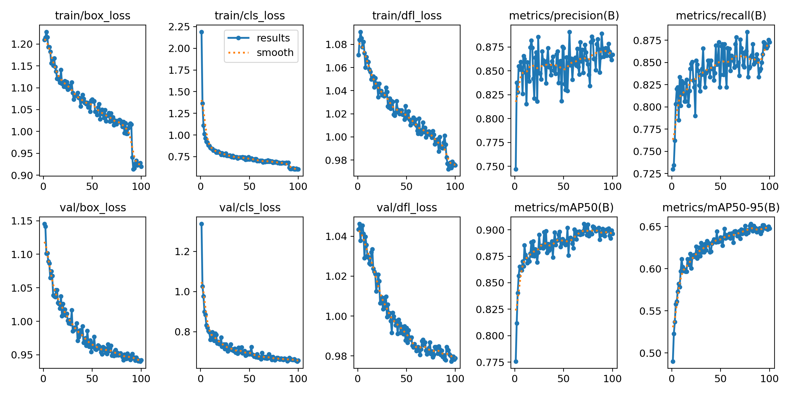
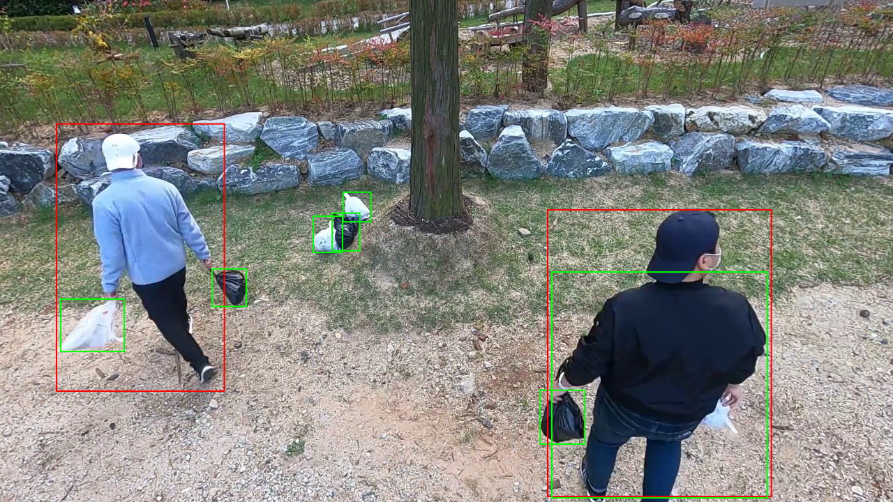
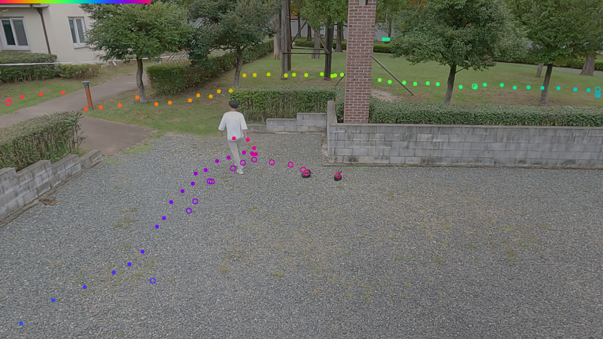

# Jump-up

# 국립한밭대학교 지능미디어공학과 VML-YLOBJ팀

**팀 구성**
- 30231232 김지영
- 20221085 김기홍
- 20221123 하현경
- 20231113 정윤선

## Project Background
- 쓰레기 무단 투기는 도시 환경과 미관을 해치고 단속이 힘들어 많은 인력과 자원을 소모함
- 무단 투기 감시용 CCTV는 설치 비용이 비싸고 지자체의 시스템에 통합되기 힘들어 효율적인 관리가 어려움
- 기존에 설치된 CCTV 시스템을 활용하여 쓰레기 무단 투기를 실시간으로 감시할 수 있는 시스템이 필요함

## System Model
- [Ultralytics의 YOLOv8 모델](https://github.com/ultralytics/ultralytics)을 사용하여 쓰레기봉투와 사람을 동시에 탐지
- AI-HUB에서 제공하는 [공원 주요시설 및 불법행위 감시 CCTV 영상 데이터](https://www.aihub.or.kr/aihubdata/data/view.do?currMenu=&topMenu=&aihubDataSe=data&dataSetSn=477)의 쓰레기봉투 이미지 사용하여 학습
- 대량의 CCTV 영상도 실시간으로 처리 가능한 경량 모델 사용

### YOLOv8 Model
|  |
| - |

- Ultralytics에서 개발한 YOLOv8은 정확도와 속도를 모두 갖춘 객체 탐지 모델
- 다양한 스케일의 특징을 탐지에 사용해서 작은 물체도 빠르게 탐지 가능
- CSPDarknet53 백본을 사용하여 적은 데이터에서도 효과적으로 학습
- 학습 이미지 해상도를 다양하게 하여 최적의 정확도를 보이는 모델 선택

### Transfer Learning
|  |
| - |
- COCO 데이터세트에 대해 우수한 성능을 보이는 pretrained 모델으로 사람을 탐지
- 쓰레기봉투에 대한 데이터를 학습하여 쓰레기봉투를 탐지하는 레이어만 전이 학습
- 모델 구조를 변경하여 두 모델을 병합하여 사용

## Run
### Development Environment
- Ubuntu 20.04 LTS
- Git
- Docker
- NVIDIA RTX 4080 SUPER GPU
- 64GB RAM

### Installation
```bash
git clone https://github.com/HBNU-SWUNIV/jump-up24-VML_YLOBJ.git
cd jump-up24-VML_YLOBJ
```

### Dataset Preparation
AI-HUB [공원 주요시설 및 불법행위 감시 CCTV 영상 데이터](https://www.aihub.or.kr/aihubdata/data/view.do?currMenu=&topMenu=&aihubDataSe=data&dataSetSn=477) 에서 쓰레기봉투 이미지와 라벨을 다운로드하여 `datasets/raw_dataset` 디렉토리에 저장

`format_convert.ipynb`를 실행하여 YOLOv8 학습을 위한 데이터셋으로 변환

### Environment Setup
```bash
docker run --detach -it --ipc=host --gpus '"device=0"' \
 -v ./ultralytics:/ultralytics \
 -v ./datasets:/content/datasets \
 ultralytics/ultralytics:latest
```

### Training [train.ipynb](ultralytics/test.ipynb)
|  |
| :--: |
| 학습 지표 |

### Testing [test.ipynb](ultralytics/test.ipynb)
|  |  |
| :--: | :--: |
| 객체 탐지 결과| 객체 이동 경로 시각화 |

### Metrics between various image sizes

| imgsz | mAP50-95 | P | R | Speed(ms) |
| :--: | :--: | :--: | :--: | :--: |
| 640 | 0.65 | 0.89 | 0.88 | **0.8** |
| 900 | 0.71 | 0.91 | 0.90 | 1.1 |
| 1280 | 0.74 | 0.90 | **0.92** | 2.1 |
| 1600 | 0.75 | **0.92** | **0.92** | 3.4 |
| 1920 | **0.77** | **0.92** | **0.92** | 4.2 |

## Conclusion
- AI-HUB에서 제공하는 데이터를 사용하여 YOLOv8 모델을 학습
- 학습한 모델을 사용하여 쓰레기봉투와 사람을 동시에 탐지 성공
- 경량화된 모델의 빠른 속도로 실시간 객체 탐지가 가능
- 실시간으로 객체를 탐지하고 경로를 시각화해서 쓰레기 무단 투기 감시에 활용 가능

## Future Work
- 탐지한 결과에서 BoT-SORT 알고리즘을 사용하여 객체를 추적할 수 있음
- 신경망 기반의 객체 추적 알고리즘을 추가하여 더 정확한 객체 추적이 가능할 것으로 기대
